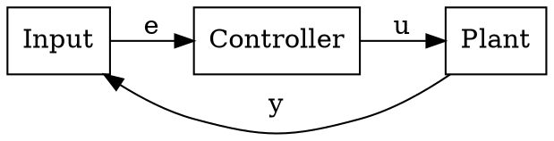

# Block Diagram Generator - Usage Guide

## Overview

`generatefigs.py` creates publication-quality block diagrams for research papers using Graphviz. It generates control system diagrams with professional styling suitable for IEEE/LaTeX publications.

## Installation

### 1. Install Python Package
```bash
pip install graphviz
```

### 2. Install Graphviz System Binaries

**Windows:**
- Download installer from: https://graphviz.org/download/
- Run installer and add to PATH
- Or use Chocolatey: `choco install graphviz`

**Linux:**
```bash
sudo apt-get install graphviz
```

**macOS:**
```bash
brew install graphviz
```

### 3. Verify Installation
```bash
dot -V
# Should output: dot - graphviz version X.X.X ...
```

## Quick Start

### Generate All Example Diagrams (PDF)
```bash
python generatefigs.py
```

This creates three example diagrams:
1. **robot_control_diagram.pdf** - Extended state observer system (from your image)
2. **feedback_linearization_diagram.pdf** - FBL control architecture
3. **ndob_diagram.pdf** - NDOB disturbance rejection

### Generate Specific Diagram
```bash
python generatefigs.py --diagram robot     # Robot manipulator only
python generatefigs.py --diagram fbl       # Feedback linearization only
python generatefigs.py --diagram ndob      # NDOB only
```

### Change Output Format
```bash
python generatefigs.py --format png        # PNG images
python generatefigs.py --format svg        # Scalable vector graphics
python generatefigs.py --format eps        # Encapsulated PostScript
```

### Custom Output Location
```bash
python generatefigs.py --output-dir my_figures --output my_diagram
```

## Creating Custom Diagrams

### Method 1: Edit the Python Script

Add a new function following this pattern:

```python
def create_my_custom_diagram(filename: str = "my_diagram") -> BlockDiagram:
    """Create your custom diagram."""
    diagram = BlockDiagram(filename, "My Custom System")
    
    # Add blocks
    diagram.add_block("input", "Input\nr(t)", width=1.2, height=0.8)
    diagram.add_block("controller", "Controller\nC(s)", width=1.5, height=0.8)
    diagram.add_block("plant", "Plant\nP(s)", width=1.5, height=0.8)
    
    # Add summing junction
    diagram.add_summing_junction("sum1", inputs=['+', '-'], size=0.4)
    
    # Add connections
    diagram.add_edge("input", "sum1", label="r")
    diagram.add_edge("sum1", "controller", label="e")
    diagram.add_edge("controller", "plant", label="u")
    
    # Add feedback
    diagram.add_feedback_path("plant", "sum1", label="y")
    
    # Add disturbance
    diagram.add_disturbance_input("dist", "Disturbance", "plant", 'n')
    
    return diagram
```

Then register it in `main()`:
```python
diagram_map = {
    'robot': ('robot', 'robot_control_diagram'),
    'fbl': ('fbl', 'feedback_linearization_diagram'),
    'ndob': ('ndob', 'ndob_diagram'),
    'custom': ('custom', 'my_custom_diagram')  # Add this line
}
```

### Method 2: Edit .gv Source Files

If Graphviz is not installed or you prefer manual editing:

```bash
python generatefigs.py --save-source
```

This generates `.gv` files you can edit directly:



Compile manually:
```bash
dot -Tpdf robot_control_diagram.gv -o robot_control_diagram.pdf
```

## Customization Options

### Block Styling

```python
diagram.add_block(
    "myblock",
    "My Block\nLabel",
    shape='box',           # 'box', 'circle', 'ellipse', 'diamond'
    width=2.0,             # Width in inches
    height=1.0,            # Height in inches
    color='#FF0000',       # Custom fill color
    style='rounded,filled' # Style options
)
```

### Connection Types

```python
# Standard edge with label
diagram.add_edge("from", "to", label="signal")

# Edge with port specification
diagram.add_edge("from", "to", from_port='e', to_port='w')

# Feedback path (doesn't constrain layout)
diagram.add_feedback_path("from", "to", label="feedback", constraint=False)

# Dashed connection
diagram.add_edge("from", "to", style='dashed')
```

### Layout Control

```python
# Change overall direction
style.RANKDIR = 'TB'  # Top to Bottom (default: 'LR' = Left to Right)

# Align nodes horizontally
diagram.set_rank_same(['node1', 'node2', 'node3'])

# Add invisible routing nodes
diagram.add_invisible_node("route1")
diagram.add_edge("block1", "route1")
diagram.add_edge("route1", "block2")
```

### Font and Color Customization

Edit the `DiagramStyle` class:

```python
class DiagramStyle:
    FONT_NAME = 'Arial'              # Change font
    FONT_SIZE = '16'                 # Larger text
    BLOCK_COLOR = '#E0E0E0'          # Light gray blocks
    BLOCK_BORDER = '#333333'         # Dark border
    SIGNAL_COLOR = '#0000FF'         # Blue signals
```

## Advanced Features

### Multi-Line Labels
Use `\n` for line breaks:
```python
diagram.add_block("block1", "First Line\nSecond Line\nThird Line")
```

### Greek Letters and Math Symbols
Use Unicode directly:
```python
diagram.add_edge("a", "b", label="θ̇")      # Theta dot
diagram.add_edge("c", "d", label="τ")       # Tau
diagram.add_summing_junction("sum", label="Σ")  # Summation
```

### Disturbance Inputs (from above)
```python
diagram.add_disturbance_input(
    "noise",           # Label node ID
    "Sensor Noise",    # Display text
    "plant",           # Target block
    'n'                # Port: 'n'=north (top)
)
```

### Complex Routing
For complex feedback paths:
```python
# Create invisible routing nodes
diagram.add_invisible_node("route1")
diagram.add_invisible_node("route2")

# Route through invisible nodes
diagram.add_edge("output", "route1")
diagram.add_edge("route1", "route2", constraint=False)
diagram.add_edge("route2", "input")
```

## Common Issues

### Graphviz Not Found
**Error:** `ExecutableNotFound: failed to execute 'dot'`

**Solution:** 
1. Install Graphviz system binaries (see Installation section)
2. Add to PATH on Windows
3. Restart terminal/VS Code after installation

### Unicode Errors
**Error:** `UnicodeEncodeError` when saving

**Solution:** Script now uses UTF-8 encoding automatically. If still failing, avoid special symbols or use basic ASCII.

### Layout Issues
- Use `constraint=False` on feedback edges
- Add invisible routing nodes for complex paths
- Experiment with `rankdir`, `ranksep`, `nodesep` settings

## Examples

### Example 1: Simple PID Loop
```python
def create_pid_loop(filename="pid_loop"):
    diagram = BlockDiagram(filename)
    
    diagram.add_block("ref", "r(t)", width=0.8)
    diagram.add_summing_junction("sum1")
    diagram.add_block("pid", "PID", width=1.2)
    diagram.add_block("plant", "Plant", width=1.2)
    
    diagram.add_edge("ref", "sum1")
    diagram.add_edge("sum1", "pid", label="e")
    diagram.add_edge("pid", "plant", label="u")
    diagram.add_feedback_path("plant", "sum1", label="y")
    
    return diagram
```

### Example 2: Cascaded Control
```python
def create_cascaded_control(filename="cascaded"):
    diagram = BlockDiagram(filename)
    
    # Outer loop
    diagram.add_block("ref", "Position\nReference")
    diagram.add_summing_junction("sum_pos")
    diagram.add_block("pos_ctrl", "Position\nController")
    
    # Inner loop
    diagram.add_summing_junction("sum_vel")
    diagram.add_block("vel_ctrl", "Velocity\nController")
    diagram.add_block("motor", "Motor\nDynamics")
    
    # Forward path
    diagram.add_edge("ref", "sum_pos")
    diagram.add_edge("sum_pos", "pos_ctrl", label="e_pos")
    diagram.add_edge("pos_ctrl", "sum_vel", label="v_ref")
    diagram.add_edge("sum_vel", "vel_ctrl", label="e_vel")
    diagram.add_edge("vel_ctrl", "motor", label="i")
    
    # Feedback paths
    diagram.add_feedback_path("motor", "sum_pos", label="x")
    diagram.add_feedback_path("motor", "sum_vel", label="v")
    
    return diagram
```

## Output for LaTeX Papers

### Include in LaTeX Document

For PDF output:
```latex
\begin{figure}[htbp]
    \centering
    \includegraphics[width=0.8\textwidth]{figures/robot_control_diagram.pdf}
    \caption{Robot manipulator control system with extended state observer.}
    \label{fig:robot_control}
\end{figure}
```

For EPS output (older LaTeX systems):
```latex
\usepackage{graphicx}
...
\includegraphics[width=0.9\columnwidth]{robot_control_diagram.eps}
```

### Recommended Settings for Publications
- Format: PDF or EPS
- DPI: 300 (already configured)
- Font: Times-Roman (LaTeX compatible)
- Colors: Professional palette (warm beige blocks, black signals)

## Command Reference

```bash
# Basic usage
python generatefigs.py                              # Generate all examples (PDF)
python generatefigs.py --help                       # Show all options

# Select diagram
python generatefigs.py --diagram robot              # Robot manipulator
python generatefigs.py --diagram fbl                # Feedback linearization
python generatefigs.py --diagram ndob               # NDOB

# Output options
python generatefigs.py --format png                 # PNG format
python generatefigs.py --format svg                 # SVG (scalable)
python generatefigs.py --format eps                 # EPS (PostScript)
python generatefigs.py --output my_custom_name      # Custom filename
python generatefigs.py --output-dir my_folder       # Custom directory

# Advanced
python generatefigs.py --save-source                # Save .gv files
python generatefigs.py --view                       # Auto-open after generation
python generatefigs.py --list-diagrams              # Show available templates
```

## Tips for Research Papers

1. **Use PDF or EPS** for vector graphics (scales perfectly)
2. **Keep labels concise** - use acronyms when possible
3. **Match paper font** - Times-Roman for IEEE, Arial for others
4. **Use consistent colors** - don't change block colors arbitrarily
5. **Test in grayscale** - many print journals are black & white
6. **Provide source** - include .gv files as supplementary material for reproducibility

## Support

For Graphviz documentation: https://graphviz.org/documentation/
For Python graphviz package: https://graphviz.readthedocs.io/

## License

This tool is part of the MicroPrecisionGimbal project. Modify and use freely for your research.
